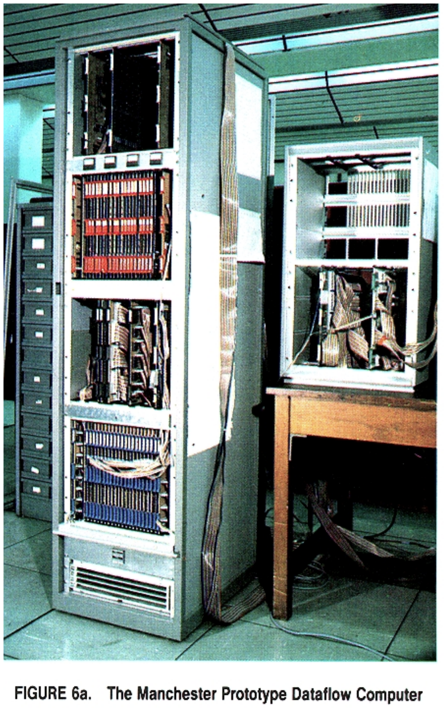

# parallel-af DEFCON 2020 Finals

This challenge is an implementation of the
[Manchester Dataflow Machine](./papers/manchester-prototype-dataflow-computer-gurd-85.pdf).

There's an excellent overview of
[dataflow machine architecture](./papers/dataflow-machine-architecture-survey-veen-86.pdf)
in this survey from '86.

## Machine Information

### Opcodes

There are 34 opcodes in the machine, and they're defined in
[types.h](./service/src/types.h).

### I/O

Output is done to stdout through the two (essentially MMIO)
destinations `OUTPUTD_DESTINATION` and `OUTPUTS_DESTINATION` (see
[types.h](./service/src/types.h)).

Input is more complicated.

There's four instructions that handle output:

1. Open, which will open a file: `<fd> = OPN <filename> <flags>`
2. Read, which will read one byte from an FD, and -1 on EOF: `<byte> = RED <fd>`
3. Write, which will write one byte to an FD: `<success> = WRT <fd> <byte>`
4. Close, which will close the file: `<success> = CLS <fd>`

An important note is that these functions can only be used by the OS.
The code loader will change all of these instructions to a DUP

### Trap mode

The processing_unit has a `trap_flag` that, when set to true, allows an x86-like trap mode single-step operation.

The trap-handeling code lives from instruction 0 to 100.

After another instruction executes (but before the `execution_result`s
are sent on the outgoing_token_packet), the following is sent to the 
following addresses (destination 0 for all):

- inst[0] = hash(`src`)
- inst[1] = hash(`destination`)
- inst[2] = `return_location`

If `1` is sent to the return_location, then the execution result will
be sent, if anything else, then it will not.

## Assembler

[assembler.py](./service/src/assembler.py) has the assembler (modeled
after the TASS language presented in the Manchester Dataflow Machine
paper).

## Compiler

[compiler.py](./service/src/compiler.py) is the compiler for a higher
level language that I called force (programming in TASS for things
like functions and if statements is painful). One thing that's very
annoying about the dataflow languages is guarding statements, so
that's why there's a lot of `foo = foo ^ foo` and other things, to
ensure that instructions are properly guarded (even if they don't have
a direct dataflow dependency). Probably a better approach would have
been to create syntax in the language to enforce that, but sometimes
you just gotta yolo.

## OS

The [os.force](./service/src/os.force) is the OS of the system. It's
the first file that boots up by the machine, so it's the only program
that can use privileged instructions (defined in
[types.c](./service/src/types.c)). It also has library functions that
help in actually using the machine (similar to libc).

## userspace

There's a number of userspace applications written in the force
language.

## Bugs

### Phase 1

In phase 1, there is no ability for the teams to write, so there's only one bug:

- Backdoor in OS

In phase 1, the backdoor was removed.

### Phase 2

In phase 2, they can use the `shell` redirection and `cat` to create their own files that are loaded. 

There's a few bugs:

- Another (different) backdoor in the OS. This can't be directly called, but the teams can directly call the `OPN` instruction. 

- Bypass the check in `open_file` by directly calling `OPN` instruction.

- Write to shared memory queues.

- Loader overwrites opcode with external symbol with undocumented/unused flag. 

The backdoor can be patched by removing that functionality.

The `OPN` instruction in `open_file` cannot be removed, so there's two
options: (1) randomize the location of `OPN` (with `cat` able to read,
this doesn't hide it from a good team) and (2) use Trap Mode (see
below) to perform data flow protect to prevent the direct calls.

An attacker can then mess with Trap Mode in two ways:

- Use hash collisions to trick the trap mode code into thinking that the call to `OPN` is valid.

- The check for trap-mode code is any code in the first 100
  instructions of the OS. The check for this incorrectly casts the
  instruction number to a 16-bit integer, which means that a clever
  attacker can overflow it.

To trigger the third bug (writing to the shared memory queues) the
teams could use lseek and write on the FDs of the shared memory queues
that act as the buses between the hardware components, thus executing
their own instructions (bypassing trap mode and all). This can be
patched by checking in the `WRT` function the FDs.

To trigger the fourth bug (loader overwrites opcode with symbol), if
the highest bit is set in the external references flags, the loader
will overwrite the opcode with the current destination of the symbol.
In this way, an attacker can create privileged opcodes in userspace. 

 
